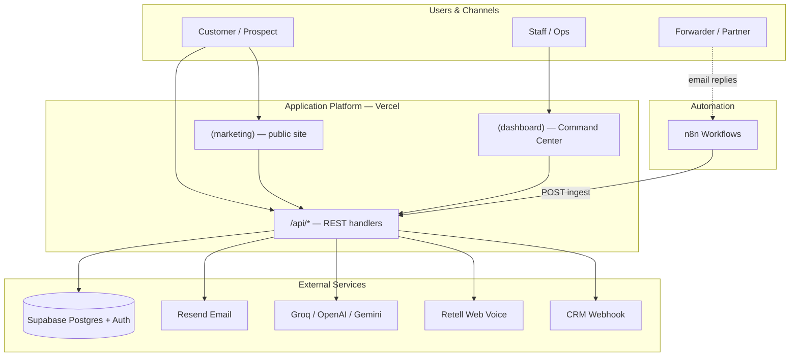
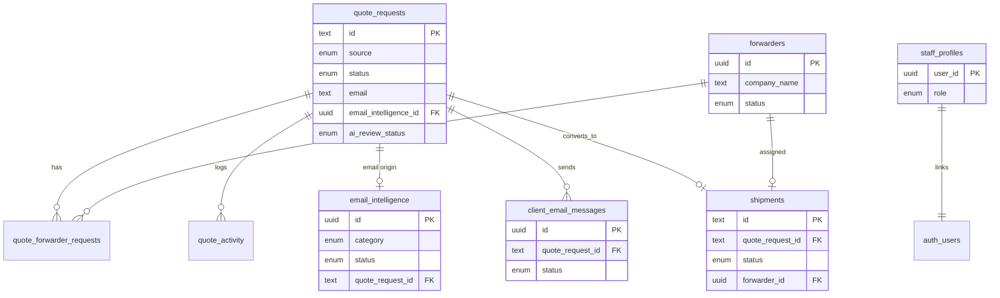
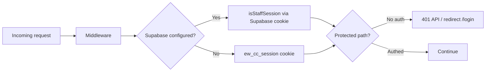
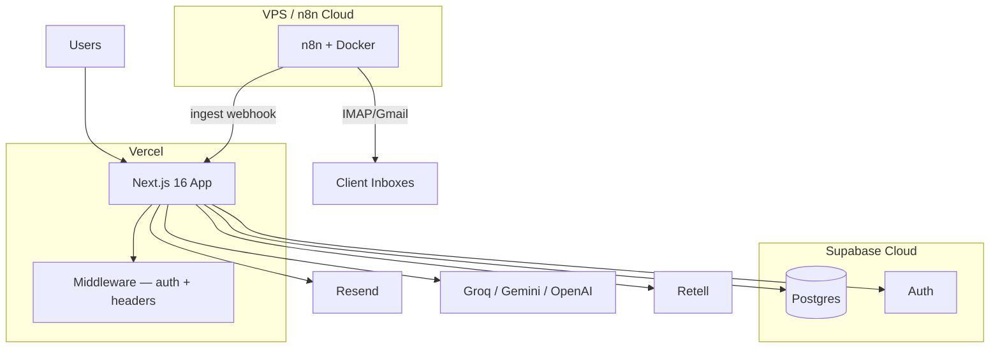

# Technical Architecture


ExpressWay Logistic is a **Next.js 16** logistics SaaS deployed on **Vercel**, backed by **Supabase (Postgres + Auth)**, with **n8n** for email automation and multiple **LLM providers** for AI features. This document describes the system design, component boundaries, data flow, and integration points.

**One-page summary:** [ARCHITECTURE_EXECUTIVE_SUMMARY.md](./ARCHITECTURE_EXECUTIVE_SUMMARY.md) · **Updated diagram:** [expressway-technical-architecture.png](./expressway-technical-architecture.png)

For product journeys and feature detail, see [PRODUCT_OVERVIEW.md](./PRODUCT_OVERVIEW.md). For API contracts, see [API.md](./API.md).

---

## 1. Design goals

| Goal | How it is met |
| --- | --- |
| **Acquisition** | SEO/AEO marketing site with quote, contact, appointment, tracking, and voice agent |
| **Operations** | Authenticated Command Center for quotes, forwarders, email intelligence, client email, shipments |
| **API-first** | REST route handlers with Zod validation; webhook ingest for n8n and future ERP/TMS connectors |
| **Swappable data layer** | Repository pattern in `src/services/` — Supabase when configured, in-memory fallback for dev |
| **Security by default** | Middleware auth gate, security headers, rate limits on public endpoints, bearer secrets for ingest |

---

## 2. System context



### Actors

| Actor | Entry points | Primary outcome |
| --- | --- | --- |
| **Customer / prospect** | Public website, Ava voice, WhatsApp (planned) | Quote, appointment, tracking |
| **Sales / ops staff** | `/command-center` | Review leads, price quotes, send emails |
| **Forwarder / partner** | Email (RFQ replies) | Rates logged by staff |
| **n8n + AI** | IMAP/Gmail/Rediffmail triggers | Classify mail, ingest, draft quotes |

---

## 3. Technology stack

| Layer | Technology |
| --- | --- |
| **Runtime** | Node.js (Vercel Fluid Compute) |
| **Framework** | Next.js 16 App Router, React 19, TypeScript 5 |
| **Styling** | Tailwind CSS 4, Radix UI, shadcn/ui primitives |
| **Server state** | TanStack Query v5 |
| **Client UI state** | Zustand (sidebar chrome) |
| **Forms / validation** | React Hook Form + Zod |
| **Database** | Supabase Postgres (migrations in `supabase/migrations/`) |
| **Auth** | Supabase Auth + RLS, demo cookie fallback |
| **Email outbound** | Resend |
| **Automation** | n8n (self-hosted VPS or n8n Cloud) |
| **AI** | Groq (primary), Gemini, OpenAI (fallbacks) |
| **Voice** | Retell WebRTC (optional) or on-site browser speech + TTS |
| **Maps** | Leaflet / react-leaflet |
| **Charts** | Recharts |
| **Testing** | Vitest (unit), Playwright (e2e) |
| **CI** | GitHub Actions (`.github/workflows/ci.yml`) |

---

## 4. Application layers

The codebase follows a strict top-down dependency rule: pages compose templates and features; features call services; services talk to Supabase or external APIs.

```
┌─────────────────────────────────────────────────────────────┐
│  Pages          src/app/(marketing|dashboard|auth)/         │
├─────────────────────────────────────────────────────────────┤
│  Templates      src/components/templates/                   │
│  Organisms      src/components/organisms/                   │
│  Molecules      src/components/molecules/                   │
│  Atoms          src/components/atoms/ + ui/                 │
├─────────────────────────────────────────────────────────────┤
│  Features       src/features/{quote,tracking,command-center,│
│                 voice-agent,appointment,client-email,...}   │
├─────────────────────────────────────────────────────────────┤
│  Services       src/services/*-repository.ts, *-memory.ts   │
├─────────────────────────────────────────────────────────────┤
│  API Routes     src/app/api/**/route.ts                     │
├─────────────────────────────────────────────────────────────┤
│  Cross-cutting  src/lib/, src/config/, src/types/,          │
│                 src/providers/, src/middleware.ts             │
└─────────────────────────────────────────────────────────────┘
```

| Layer | Responsibility |
| --- | --- |
| **Presentation** | Atomic Design components, layouts, marketing templates |
| **Features** | Domain UI + hooks (`quote`, `tracking`, `command-center`, `voice-agent`) |
| **Services** | Data access, business orchestration, external integrations |
| **API routes** | HTTP boundary — Zod parse, auth check, rate limit, structured response |
| **Cross-cutting** | Auth, Supabase clients, LLM helpers, logging, SEO, security middleware |

---

## 5. Routing & route groups

| Route group | Path prefix | Auth | Purpose |
| --- | --- | --- | --- |
| `(marketing)` | `/`, `/quote`, `/track`, … | Public | SEO pages, lead capture, tracking |
| `(dashboard)` | `/command-center/*` | Staff session | Ops modules |
| `(auth)` | `/login` | Public (redirect if authed) | Staff sign-in |
| `api/*` | `/api/*` | Mixed | REST endpoints |

### Command Center modules

| Module | Route | Data source |
| --- | --- | --- |
| Overview | `/command-center` | Aggregated KPIs |
| Shipments | `/command-center/shipments` | `GET /api/shipments` |
| Quote Requests | `/command-center/quotes` | `GET /api/quotes` |
| Forwarders | `/command-center/forwarders` | `GET /api/forwarders` |
| Email Intelligence | `/command-center/emails` | `GET /api/email-intelligence` |
| Client Email Agent | `/command-center/client-email` | `/api/client-email/*` |
| Calendar | `/command-center/calendar` | `GET /api/calendar` |
| Analytics | `/command-center/analytics` | Recharts + shipment data |
| AI Copilot | `/command-center/ai` | `POST /api/ai/insights` |

---

## 6. API surface

All responses use a consistent envelope:

```json
{ "success": true, "data": {}, "message": "optional" }
```

### Public endpoints (rate-limited)

| Endpoint | Rate limit | Validation |
| --- | --- | --- |
| `POST /api/contact` | 8 / IP / min | `quoteFormSchema` |
| `POST /api/quote` | 6 / IP / min | `quoteWizardSchema` |
| `POST /api/appointment` | 8 / IP / min | `appointmentFormSchema` |
| `GET /api/tracking?id=` | — | Tracking ID lookup |
| `POST /api/voice-agent/*` | Per-route | Voice session + Retell tools |

### Protected endpoints (staff session)

Protected by `src/middleware.ts` via `isProtectedPath()`:

```
/api/shipments, /api/quotes, /api/forwarders, /api/calendar,
/api/ai, /api/email-intelligence, /api/client-email
```

Also: all `/command-center/*` pages.

**Exception:** `POST /api/email-intelligence/ingest` is public but secured with `EMAIL_INGEST_SECRET` bearer token (n8n only).

### Webhook / ingest endpoints

| Endpoint | Auth | Caller |
| --- | --- | --- |
| `POST /api/email-intelligence/ingest` | `Bearer EMAIL_INGEST_SECRET` | n8n workflow |
| `POST /api/voice-agent/retell/tools` | `Bearer RETELL_TOOL_SECRET` | Retell agent |

Full API reference: [API.md](./API.md).

---

## 7. Data architecture

### Entity ID formats

| Entity | ID pattern | Example |
| --- | --- | --- |
| Quote request | `QW-{timestamp}` | `QW-1734567890123` |
| Shipment | `EW-{number}` | `EW-10847` |
| Appointment | `AP-{timestamp}` | `AP-1734567890123` |

Forwarders, email intelligence records, and client email messages use UUID primary keys.

### Database schema (Supabase Postgres)

Migrations run in order (`001` → `008`):



#### Core tables

| Table | Migration | Purpose |
| --- | --- | --- |
| `quote_requests` | 001, 005, 006 | Lead intake + full quote pipeline |
| `appointments` | 001 | Consultation bookings |
| `staff_profiles` | 003 | Staff roles linked to Supabase Auth |
| `forwarders` | 005 | Partner directory |
| `quote_forwarder_requests` | 005 | RFQ tracking per forwarder |
| `quote_activity` | 005 | Audit trail |
| `email_intelligence` | 004, 006 | AI-classified inbox |
| `client_email_messages` | 007 | Outbound client email history |
| `email_branding_settings` | 007 | Branded HTML template config |
| `shipments` | 008 | Operational shipment board |

#### Quote status pipeline

```
New → Under Review → Sent to Forwarders → Awaiting Forwarder Quotes
  → Quote Received → Quoted (or Quote Ready / Email Failed)
  → Accepted | Rejected | Expired
```

#### Email AI review statuses

`needs_review` · `needs_info` · `confirmed` · `dismissed`

### Repository pattern

Services in `src/services/` abstract persistence:

| Service | Supabase | Fallback |
| --- | --- | --- |
| `quotes-repository.ts` | When `SUPABASE_URL` set | `quotes-memory.ts` |
| `leads-repository.ts` | Quote + appointment insert | In-memory |
| `forwarders-repository.ts` | CRUD | — |
| `email-intelligence-repository.ts` | Ingest + board | — |
| `client-email-repository.ts` | Draft/send history | `client-email-memory.ts` |
| `shipments-repository.ts` | Shipment CRUD | `shipments-memory.ts` |
| `tracking-repository.ts` | Lookup by ID | Demo seed |

This allows local development without Supabase while production uses Postgres.

### Row-level security

- RLS enabled on all tables
- Public API routes use **service role** key (bypasses RLS)
- Authenticated staff sessions use **authenticated** role with `is_staff()` policies
- Staff roles: `admin` · `ops` · `viewer`

Setup: [SUPABASE.md](./SUPABASE.md), bootstrap: `scripts/bootstrap-staff.mjs`

---

## 8. Authentication & security

### Auth modes



| Mode | Trigger | Mechanism |
| --- | --- | --- |
| **Production** | `SUPABASE_URL` + keys set | Supabase Auth session + `staff_profiles` |
| **Demo fallback** | Supabase Auth unset | Cookie `ew_cc_session` + `AUTH_EMAIL`/`AUTH_PASSWORD` |

### Middleware security headers

Applied to all matched routes in `src/middleware.ts`:

- `X-Frame-Options: DENY`
- `X-Content-Type-Options: nosniff`
- `Strict-Transport-Security`
- `Content-Security-Policy` (allows `connect-src` for voice WebRTC)
- `Permissions-Policy` (microphone for Ava)
- `Cache-Control: no-store` on API responses

### Secrets & ingest auth

| Secret | Used by |
| --- | --- |
| `EMAIL_INGEST_SECRET` | n8n → `/api/email-intelligence/ingest` |
| `RETELL_TOOL_SECRET` | Retell → `/api/voice-agent/retell/tools` |
| `SUPABASE_SERVICE_ROLE_KEY` | Server-side DB writes (never exposed to browser) |

---

## 9. Integration architecture

### Lead delivery (quote, contact, appointment)

```
Form submit → Zod validate → rate limit → leads-repository (Supabase)
                                        → CONTACT_WEBHOOK_URL (optional CRM)
                                        → Resend email (LEAD_NOTIFY_EMAIL)
```

Env: `CONTACT_WEBHOOK_URL`, `RESEND_API_KEY`, `LEAD_NOTIFY_EMAIL`, `LEAD_NOTIFY_FROM`

### Email intelligence pipeline

```
Client inbox (Gmail / IMAP / Rediffmail)
    → n8n trigger
    → AI classification (Groq/Gemini in n8n)
    → POST /api/email-intelligence/ingest
    → Supabase email_intelligence + optional quote_requests draft
    → Command Center /emails and /quotes
```

Workflow files: `n8n/expressway-email-intelligence*.workflow.json`  
Setup: [EMAIL_INTELLIGENCE.md](./EMAIL_INTELLIGENCE.md), [N8N_SETUP.md](./N8N_SETUP.md)

### Quote → forwarder → customer flow

Orchestrated in `src/services/quotes-forwarder-flow.ts`:

1. Staff sends RFQs → `POST /api/quotes/:id/forwarders` → Resend to forwarder emails
2. Forwarder replies (email) → n8n ingest → attach to existing quote
3. Staff records rate → `POST /api/quotes/:id/forwarder-quotes`
4. Staff selects forwarder → `POST /api/quotes/:id/select-forwarder` (applies margin)
5. Staff sends customer quote → `POST /api/quotes/:id/send` → Resend

### Client Email Agent

AI-assisted outbound email from Command Center:

```
Staff prompt → POST /api/client-email/draft (LLM)
            → POST /api/client-email/refine (optional)
            → POST /api/client-email/preview (branded HTML)
            → POST /api/client-email/send (Resend)
            → client_email_messages history
```

Branding from `email_branding_settings` table.

### Ava voice agent

Two modes, selected by env:

| Mode | Condition | Stack |
| --- | --- | --- |
| **Retell web call** | `RETELL_API_KEY` + `RETELL_AGENT_ID` set | Retell Client SDK → tool webhooks |
| **On-site receptionist** | Retell unset | Browser SpeechRecognition + Groq/OpenAI LLM + Groq TTS |

Retell tools call back to the app:

- `get_site_info` · `book_appointment` · `submit_quote` · `track_shipment`

---

## 10. AI services

LLM calls are centralized in `src/lib/llm-json.ts` with provider fallback:

```
Groq (GROQ_API_KEY) → Gemini (GEMINI_API_KEY) → OpenAI (OPENAI_API_KEY)
```

| Feature | LLM usage | Location |
| --- | --- | --- |
| Email RFQ extraction | JSON structured output | `email-quote-intelligence.ts` |
| Client email draft/refine | Text generation | `client-email-draft.ts` |
| AI Copilot insights | NL query → ops answer | `/api/ai/insights` |
| Ava receptionist | Conversation + tool calls | `features/voice-agent/llm.ts` |
| Ava TTS | Groq Orpheus or OpenAI | `features/voice-agent/tts.ts` |
| n8n classification | Groq/Gemini (in workflow) | `n8n/ai-classify-code.js` |

Model default: `GROQ_MODEL=openai/gpt-oss-20b` (override via env).

---

## 11. Deployment topology



| Component | Host | Notes |
| --- | --- | --- |
| **Next.js app** | Vercel | `expresswaylogistic.com`, Fluid Compute |
| **Postgres + Auth** | Supabase | Migrations via SQL Editor or CLI |
| **n8n** | Separate VPS | Not on Vercel — long-running IMAP listeners |
| **Resend** | SaaS | Outbound transactional email |
| **LLM providers** | SaaS API | Groq primary |
| **Retell** | SaaS | Optional web voice |

Guides: [DEPLOYMENT.md](./DEPLOYMENT.md), [PRODUCTION_SETUP.md](./PRODUCTION_SETUP.md)

### Environment variables (summary)

See `.env.example` for the full list. Critical production vars:

| Variable | Required for |
| --- | --- |
| `SUPABASE_URL`, `SUPABASE_SERVICE_ROLE_KEY` | Data persistence |
| `NEXT_PUBLIC_SUPABASE_URL`, `NEXT_PUBLIC_SUPABASE_ANON_KEY` | Staff login |
| `NEXT_PUBLIC_APP_URL` | Absolute URLs, Retell callbacks |
| `EMAIL_INGEST_SECRET` | n8n ingest security |
| `RESEND_API_KEY` | Email delivery |
| `GROQ_API_KEY` | AI features |

---

## 12. State management

| Concern | Tool | Scope |
| --- | --- | --- |
| Server/async data | TanStack Query | Quotes, shipments, emails, forwarders |
| UI chrome | Zustand | Sidebar open/closed |
| Forms | React Hook Form + Zod | Quote wizard, login, ops forms |
| Theme | next-themes | Dark/light mode |

Business logic lives in `features/` and `services/`, not in page components.

---

## 13. Observability

Optional, env-driven hooks:

| Service | Env var |
| --- | --- |
| Google Analytics 4 | `NEXT_PUBLIC_GA_ID` |
| Google Tag Manager | `NEXT_PUBLIC_GTM_ID` |
| Microsoft Clarity | `NEXT_PUBLIC_CLARITY_ID` |
| Sentry | `SENTRY_DSN` |

Structured logging via `src/lib/logger.ts` in API routes.

Health check: `GET /api/health`

---

## 14. Extensibility

### TMS / ERP connector (future)

Replace or extend `src/services/*-repository.ts` with live TMS adapters. UI contracts in `src/types/` remain stable.

### WhatsApp AI agent (planned)

Meta WhatsApp Cloud API integration documented in [WHATSAPP_AI_AGENT.md](./WHATSAPP_AI_AGENT.md). Will follow the same pattern: webhook → API route → Supabase → Command Center.

### Shipment tracking (live)

Current tracking uses repository adapter with demo data. Production path: connect carrier APIs or TMS webhook → update `shipments` table → public `/track` lookup.

### Auth hardening

RLS policies and `staff_profiles` roles are in place. Additional roles, SSO, or Better Auth can be layered via middleware without changing feature modules.

---

## 15. Related documentation

| Document | Contents |
| --- | --- |
| [PRODUCT_OVERVIEW.md](./PRODUCT_OVERVIEW.md) | Product features, journeys, module detail |
| [API.md](./API.md) | REST endpoint contracts |
| [SHIPPING_JOURNEY.md](./SHIPPING_JOURNEY.md) | End-to-end shipping journey |
| [EMAIL_INTELLIGENCE.md](./EMAIL_INTELLIGENCE.md) | n8n email pipeline setup |
| [SUPABASE.md](./SUPABASE.md) | Database and auth setup |
| [DEPLOYMENT.md](./DEPLOYMENT.md) | Vercel + n8n deployment |
| [COMPONENTS.md](./COMPONENTS.md) | UI component catalogue |
