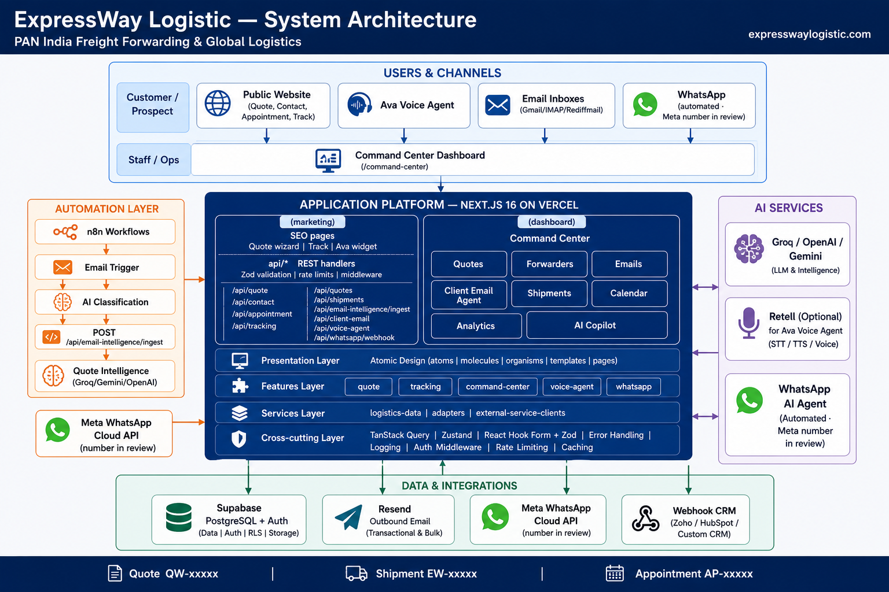

# ExpressWay Logistic — Product Overview

**Site:** [expresswaylogistic.com](https://expresswaylogistic.com)  
**Company:** Expressway Logistic Private Limited  
**Tagline:** PAN India Freight Forwarding & Global Logistics  
**HQ:** Unit No. 623, 6th Floor, Tower-1, Assotech Business Cresterra, Sector-135, Noida, Uttar Pradesh 201305  
**Sales:** sales@expresswaylogistics.com · +91 98736 93160

This document is the full product and technical reference for the ExpressWay Logistic SaaS: public marketing website + AI Logistics Command Center. **Section 5** walks each major journey end-to-end (website quote, forwarder RFQ, email AI, Ava, appointments, tracking, and outbound client email).

---

## 1. Product summary

ExpressWay Logistic is a **premium logistics SaaS** with two product surfaces:

| Surface | Audience | Purpose |
| --- | --- | --- |
| **Enterprise marketing website** | Shippers, importers/exporters, SMEs | Brand, SEO/AEO acquisition, quotes, appointments, tracking, voice agent |
| **AI Logistics Command Center** | Staff (sales / ops) | Quote pipeline, forwarders, email intelligence, client email agent, shipments, analytics, AI copilot |

**Commercial positioning:** Neutral Logistics Provider — PAN India origins to worldwide destinations (ocean, air, customs, EXIM advisory, project cargo, door-to-door). Not a single-city forwarder.

---

## 2. Architecture at a glance



```
┌─────────────────────────────────────────────────────────────────┐
│                     Public Marketing Site                         │
│  Quote · Contact · Appointment · Track · Ava · SEO pages          │
└────────────────────────────┬────────────────────────────────────┘
                             │ REST (/api/*)
┌────────────────────────────▼────────────────────────────────────┐
│              Next.js 16 App (Vercel)                              │
│  Route Handlers · Zod · Rate limits · Middleware security         │
└──────┬─────────────────┬──────────────────┬─────────────────────┘
       │                 │                  │
       ▼                 ▼                  ▼
  Supabase          Resend / webhook     Groq / OpenAI / Gemini
  (Postgres+Auth)   (leads & quotes)     (classify, drafts, TTS)
       ▲
       │ ingest
  n8n (IMAP/Gmail/Rediffmail) ──► Email Intelligence
       │
┌──────▼──────────────────────────────────────────────────────────┐
│              Command Center (staff session)                       │
│  Quotes · Forwarders · Emails · Client Email · Shipments · AI     │
└─────────────────────────────────────────────────────────────────┘
```

### Code layout

| Path | Role |
| --- | --- |
| `src/app/` | Routes: `(marketing)`, `(dashboard)`, `(auth)`, `api/*` |
| `src/components/` | Atomic Design: atoms → molecules → organisms → templates → layouts |
| `src/features/` | Domain modules (quote, tracking, command-center, voice-agent, …) |
| `src/services/` | Data adapters / integrations (swappable for live TMS later) |
| `src/lib/` `src/config/` `src/types/` `src/store/` `src/providers/` | Cross-cutting |

**State model**

- Server/async: TanStack Query  
- UI chrome: Zustand (`sidebarOpen`)  
- Forms: React Hook Form + Zod  

Business logic lives in `features/`. Pages compose templates and features only.

---

## 3. Marketing website — pages & features

### 3.1 Primary navigation

| Label | Route |
| --- | --- |
| Services | `/services` |
| Industries | `/industries` |
| PAN India | `/pan-india-logistics` |
| Routes | `/shipping-routes` |
| About | `/about` |
| Track | `/track` |
| **Get a Quote** (CTA) | `/quote` |
| Ops Login | `/command-center` (auth required) |

### 3.2 Page catalogue

| Area | Routes | Functionality |
| --- | --- | --- |
| Home | `/` | Brand hero, services preview, industries, process, CTAs |
| Services | `/services`, `/services/[slug]` | Catalogue + 15 detail pages |
| Industries | `/industries`, `/industries/[slug]` | 12 cargo verticals |
| PAN India | `/pan-india-logistics`, `/pan-india-logistics/[slug]` | Regional / origin coverage SEO |
| Shipping routes | `/shipping-routes`, `/shipping-routes/[slug]` | Trade-lane SEO pages |
| Locations | `/locations`, `/locations/[slug]` | Office / city / port pages (e.g. Noida HQ, Nhava Sheva, Mundra) |
| Process | `/process` | 5-step customer journey |
| About | `/about` | Company story, leadership, differentiators |
| Quote | `/quote` | Multi-step RFQ wizard |
| Contact | `/contact` | Contact / short quote form |
| Appointment | `/appointment` | Book consult slots (weekday IST) |
| Track | `/track` | Public shipment lookup |
| Resources | `/resources`, guides, glossary, FAQ | Content hub for SEO/AEO |
| Legal | `/privacy`, `/terms` | Legal pages |
| Auth | `/login` | Staff sign-in |

### 3.3 Service catalogue (15)

Defined in `src/constants/services.ts`:

1. Freight Forwarding  
2. Neutral Logistics Provider  
3. Ocean Freight  
4. Air Freight  
5. FCL Shipping  
6. LCL Shipping  
7. Consolidation  
8. Customs Clearance  
9. Warehousing  
10. Door-to-Door Logistics  
11. Project Cargo  
12. Cargo Insurance  
13. EXIM Consultancy  
14. Packing & Handling  
15. Freight Booking  

### 3.4 Industries (12)

Leather Products · Garments & Apparel · Pharma & Bulk Drugs · Handicrafts · Engineering Goods · Herbal & Medicaments · Personal Effects · Project Machinery · Second-hand Machinery · Bulk Cargo · Coastal Cargo · Chemicals  

### 3.5 Process journey (5 steps)

1. Request a Quote  
2. Booking & Docs  
3. Pickup & Dispatch  
4. Clearance & Updates  
5. Door Delivery  

### 3.6 Lead capture & engagement

| Feature | Route / API | Behaviour |
| --- | --- | --- |
| **Quote wizard** | `/quote` → `POST /api/quote` | Multi-step form; Zod `quoteWizardSchema`; rate limit **6 req / IP / min**; webhook + Resend + Supabase persistence |
| **Contact / short quote** | `/contact` → `POST /api/contact` | Zod `quoteFormSchema`; rate limit **8 / IP / min**; same delivery path |
| **Appointment booking** | `/appointment` → `POST /api/appointment` | Types: freight planning, customs, project cargo, EXIM advisory, packing, warehouse visit, onboarding; weekday IST slots; rate limit **8 / IP / min** |
| **Public tracking** | `/track` → `GET /api/tracking?id=` | Lookup by tracking ID (demo example: `EW-10847`) |
| **WhatsApp** | Meta WhatsApp Cloud API | **Automated** AI agent (quote, FAQs, appointment, tracking, human handoff) — phone number **in review with Meta**; site still has `wa.me` until API goes live |
| **Ava voice agent** | Help menu / widget | Browser-only call (no phone number) |

### 3.7 Ava voice agent

**Talk to Ava** is a **web call** only — no Twilio/SIP inbound number.

| Mode | When | Behaviour |
| --- | --- | --- |
| **Retell web call** | `RETELL_API_KEY` + `RETELL_AGENT_ID` + `RETELL_TOOL_SECRET` set | Browser call via Retell Client SDK |
| **On-site receptionist** | Retell unset | Browser speech recognition + LLM + Groq/OpenAI TTS |

**Tool functions** (Retell → `POST /api/voice-agent/retell/tools`):

| Tool | Purpose |
| --- | --- |
| `get_site_info` | Company / services / contact facts |
| `book_appointment` | Create appointment lead |
| `submit_quote` | Submit quote request |
| `track_shipment` | Tracking lookup |

Auth header: `Authorization: Bearer <RETELL_TOOL_SECRET>`.  
Agent prompt source: `buildRetellAgentPrompt()` in `src/features/voice-agent/knowledge.ts`.

Related APIs: `/api/voice-agent`, `/api/voice-agent/speak`, `/api/voice-agent/retell/web-call`, `/api/voice-agent/retell/user-text`, `/api/voice-agent/retell/tools`.

### 3.8 SEO & AEO

- Page metadata, Open Graph, Twitter cards  
- `sitemap.xml` / `robots.txt`  
- JSON-LD: Organization, Service, FAQ, WebSite  
- Location / route / industry / service landing pages with direct-answer copy  
- Observability hooks for GA4, GTM, Clarity, Sentry (env-driven)

---

## 4. Command Center — modules & functionality

**Base URL:** `/command-center`  
**Auth:** Supabase staff session when configured; demo fallback `AUTH_EMAIL` / `AUTH_PASSWORD` when Supabase Auth is unset.  
**Shell:** Sidebar + topbar (`src/features/command-center/`).

### 4.1 Module map

| Module | Route | Functionality |
| --- | --- | --- |
| **Overview** | `/command-center` | Ops snapshot, KPIs, recent activity |
| **Shipments** | `/command-center/shipments` | Shipment board / table (`GET /api/shipments`) |
| **Quote Requests** | `/command-center/quotes` | Full quote pipeline, filters, detail sheet, AI drafts, send quotes |
| **Forwarders** | `/command-center/forwarders` | Partner directory CRUD |
| **Email Intelligence** | `/command-center/emails` | AI-classified inbox board |
| **Client Email Agent** | `/command-center/client-email` | AI draft / refine / preview / send; branding; history |
| **Calendar** | `/command-center/calendar` | Appointments / schedule panel |
| **Analytics** | `/command-center/analytics` | Charts and operational metrics (Recharts) |
| **AI Copilot** | `/command-center/ai` | Natural-language ops queries |

### 4.2 Quote management (core ops workflow)

#### Intake sources

- Website quote wizard / contact form  
- Ava voice (`submit_quote`)  
- Email Intelligence (n8n ingest → AI draft when RFQ detected)

#### Status pipeline

```
New
 → Under Review
 → Sent to Forwarders
 → Awaiting Forwarder Quotes
 → Quote Received
 → Quoted                          (customer email succeeded)
    or Quote Ready / Email Failed  (Resend failed — retry)
 → Accepted | Rejected | Expired
```

UI short labels (list chips): New · In review · Sent · Waiting · Received · Emailed · Failed · Accepted / Rejected / Expired.

#### Email AI review statuses

| Status | Meaning |
| --- | --- |
| `needs_review` | AI draft ready for staff review |
| `needs_info` | RFQ incomplete — sales alert |
| `confirmed` | Staff confirmed draft → moves **New** → **Under Review** |
| `dismissed` | Staff dismissed AI draft |

List filters include: All sources · Email AI · AI drafts · Needs info.

#### Staff capabilities

| Action | API | Detail |
| --- | --- | --- |
| List quotes | `GET /api/quotes` | Repeat-customer flags |
| View detail | `GET /api/quotes/:id` | Prior quotes, forwarder requests, activity |
| Update | `PATCH /api/quotes/:id` | Status, amounts, notes, validity, margin, `aiReviewStatus` |
| Email customer quote | `POST /api/quotes/:id/send` | Via Resend; status depends on send success |
| Send RFQs to forwarders | `POST /api/quotes/:id/forwarders` | `{ forwarderIds: [...] }` |
| Record forwarder quote | `POST /api/quotes/:id/forwarder-quotes` | Partner rate response |
| Select forwarder | `POST /api/quotes/:id/select-forwarder` | Preferred partner + apply margin |

Quote fields include pickup/delivery locations, required delivery date, currency (default INR), additional charges, discount, validity, assigned_to, forwarder_cost, margin, selected_forwarder_id.

Demo walkthrough: [QUOTE_FLOW_DEMO_SCRIPT.md](./QUOTE_FLOW_DEMO_SCRIPT.md).

### 4.3 Forwarders

- Active/Inactive directory  
- Company, contact, email, phone, service types, origin/destination coverage, preferred routes, notes  
- Used as targets for RFQ emails  
- Delete returns **409** if the forwarder is already used on a quote  

APIs: `GET|POST /api/forwarders`, `PATCH|DELETE /api/forwarders/:id`.

### 4.4 Email Intelligence

Pipeline:

```
Client inboxes (Gmail / IMAP / Rediffmail)
        → n8n trigger + AI classification
        → POST /api/email-intelligence/ingest  (Bearer EMAIL_INGEST_SECRET)
        → Supabase store + optional quote draft
        → Command Center /emails and /quotes
```

**Categories:** `shipment` · `quotation` · `alert` · `general`

**Quote intelligence outcomes:**

| Case | Result |
| --- | --- |
| Client RFQ complete | Quotes list · AI draft · needs review |
| Client RFQ incomplete | Quotes list · Needs info · sales alert |
| Forwarder rate / follow-up | Attach to existing quote |
| Other | Email Intelligence board only |

Staff can set email status: `new` → `read` → `actioned` / `archived`.

Workflow imports:

| File | Use when |
| --- | --- |
| `n8n/expressway-email-intelligence.workflow.json` | 4 Gmail inboxes |
| `n8n/expressway-email-intelligence-imap.workflow.json` | Single IMAP inbox |
| `n8n/expressway-email-intelligence-rediffmail.workflow.json` | Rediffmail `support@` |
| `n8n/expressway-email-intelligence-sales.workflow.json` | Rediffmail `sales@` |

Full setup: [EMAIL_INTELLIGENCE.md](./EMAIL_INTELLIGENCE.md), [N8N_SETUP.md](./N8N_SETUP.md), [PRODUCTION_SETUP.md](./PRODUCTION_SETUP.md).

### 4.5 Client Email Agent

Outbound AI-assisted client email from the Command Center:

| Capability | API |
| --- | --- |
| Draft | `POST /api/client-email/draft` |
| Refine | `POST /api/client-email/refine` |
| Preview | `POST /api/client-email/preview` |
| Send | `POST /api/client-email/send` |
| History | `GET /api/client-email/history` |
| Contacts helper | `/api/client-email/contacts` |
| Branding settings | `/api/client-email/branding` |

**Data (migration 007):**

- `client_email_messages` — draft/sent/failed history, optional `quote_request_id`, HTML/text body, recipients  
- `email_branding_settings` — company name, tagline, website, contact, logo/colours for branded HTML  

### 4.6 Shipments, calendar, analytics, AI copilot

| Module | Behaviour |
| --- | --- |
| Shipments | Operational board from `/api/shipments` (adapter-backed; replaceable with live TMS) |
| Calendar | Appointment / schedule view via `/api/calendar` |
| Analytics | Charts (Recharts) for ops metrics |
| AI Copilot | `POST /api/ai/insights` with `{ "query": "..." }` — NL operations queries; also `GET` for insight feed |

### 4.7 Auth

| Endpoint | Purpose |
| --- | --- |
| `POST /api/auth/login` | Staff login |
| `POST /api/auth/logout` | End session |

`/command-center` and related APIs are gated by staff session middleware. Bootstrap helper: `scripts/bootstrap-staff.mjs`. Setup guide: [SUPABASE.md](./SUPABASE.md).

---

## 5. End-to-end functionality

This section explains how the main business journeys work **from first user action to final outcome**, across website, APIs, database, email, and Command Center.

### 5.0 System actors

| Actor | Who | What they do |
| --- | --- | --- |
| **Customer / prospect** | Shipper on the public site | Requests quotes, books appointments, tracks, talks to Ava |
| **Sales / ops staff** | Command Center user | Reviews leads, prices quotes, emails customers & forwarders |
| **Forwarder / partner** | External logistics partner | Receives RFQs by email, replies with rates (logged by staff) |
| **n8n + AI** | Automation | Reads inboxes, classifies mail, creates draft quotes |
| **Ava** | Voice agent | Collects quote / appointment / tracking via browser call |

---

### 5.1 Flow A — Website quote → priced & emailed to customer

**Goal:** A visitor submits cargo details online; staff prices the job and emails a formal quotation.

```
Customer (/quote wizard)
    → POST /api/quote  (Zod + rate limit)
    → Supabase quote_requests  [status: New]
    → notifyLead (webhook and/or Resend to sales)
    → Staff opens /command-center/quotes
    → Choose "Quote the customer"
    → Enter amount / validity / notes  → Save (optional draft)
    → "Email customer quote"  → POST /api/quotes/:id/send
    → Resend email to customer
         ├─ success → status: Quoted (UI: Emailed)
         └─ failure → Quote Ready / Email Failed (UI: Failed → Retry)
    → Later: status Accepted | Rejected | Expired
```

**Step-by-step**

1. **Customer** opens `/quote` and completes the wizard:
   - Cargo details  
   - Origin / destination lane  
   - Insurance, project cargo, packing, customs options  
   - Contact (who should receive the quote)  
2. Browser calls `POST /api/quote`. The API validates input, creates a **reference ID**, inserts a `quote_requests` row (`New`), and notifies sales (`notifyLead`).  
3. **Staff** signs in → **Quote Requests** → finds the row (filter **New** or search).  
4. Opens detail sheet → **Quote the customer** (direct path; best for repeat customers / known rates).  
5. Fills **Amount**, **Valid for**, optional charges/margin/notes.  
6. **Save** stores work without emailing; **Email customer quote** sends via Resend.  
7. Customer receives the quotation; list chip becomes **Emailed**. Staff may later mark **Accepted** / **Rejected** / **Expired**.

**Nothing auto-emails the customer** until staff clicks **Email customer quote**.

---

### 5.2 Flow B — Website quote → ask forwarders → margin → email customer

**Goal:** Competitive pricing for a new or complex request via partner RFQs.

```
Customer submits quote  →  quote_requests [New]
Staff: "Ask partners"
    → Select Active forwarders
    → POST /api/quotes/:id/forwarders
    → Resend RFQ emails to partners
    → status: Sent to Forwarders → Awaiting Forwarder Quotes
Partner replies (email / phone — outside the app)
Staff: "Log a partner reply"  → POST .../forwarder-quotes
    → status: Quote Received
Staff: "Use this rate"  → POST .../select-forwarder
    → Apply margin → customer amount
Staff: "Continue to customer quote" → Email customer quote
    → status: Quoted
```

**Step-by-step**

1. Same intake as Flow A (website / contact / voice → `New` quote).  
2. Staff ensures at least one **Active** forwarder exists under **Forwarders**.  
3. On the quote sheet, choose **Ask partners** → **Select partners** → **Email selected partners**.  
4. Each selected partner gets an RFQ email; the quote moves through **Sent** / **Waiting**.  
5. When a partner quotes back (outside the product), staff **Log a partner reply** (amount, transit, validity, carrier).  
6. Staff **Use this rate** → reviews partner cost, margin, and customer amount → **Continue to customer quote**.  
7. Staff emails the customer (same as Flow A). Partners never see the final customer price.

---

### 5.3 Flow C — Email RFQ → AI draft → staff confirm → quote ops

**Goal:** Inbound client email becomes a structured quote draft; humans stay in control.

```
Client sends RFQ to company inbox
    → n8n IMAP/Gmail/Rediffmail trigger
    → AI classify (shipment | quotation | alert | general)
    → POST /api/email-intelligence/ingest  (+ Bearer secret)
    → Store row in Email Intelligence
    → If quotation / RFQ: processEmailQuoteIntelligence
         ├─ complete enough → quote_requests + ai_review_status: needs_review
         │                    (UI: AI draft · Ready for review)
         └─ incomplete     → quote_requests + needs_info
                              (+ sales alert email_quote_needs_info)
Staff reviews /command-center/emails and/or /quotes
    → "Confirm and take over"  → Under Review
         OR "Not a quote" / dismiss
    → Then Flow A or Flow B (price / partners / email)
```

**Step-by-step**

1. Email arrives in ops/quotes/info inbox.  
2. **n8n** reads it, runs classification + field extraction, posts to the ingest API.  
3. Command Center **Email Intelligence** shows the message (category, AI summary, urgency, extracted fields).  
4. For RFQs, the app also creates a **linked quote**:
   - **AI drafts** — enough origin/destination/cargo/contact to price later  
   - **Needs info** — missing fields listed; suggested chase email; do **not** send to forwarders yet  
5. Staff opens the linked quote → **Confirm and take over** (moves toward **Under Review**) or dismisses misclassified mail.  
6. From there, pricing is identical to Flow A or B.

**Golden rule:** AI never emails the customer or forwarders. Staff must confirm and click send actions.

---

### 5.4 Flow D — Forwarder reply email attached to an existing quote

**Goal:** Partner rate emails update an open quote instead of creating a new lead.

```
Forwarder emails a rate / follow-up
    → n8n classify as quotation (forwarder context)
    → ingest API
    → App matches / attaches to existing quote_request
    → Staff sees update on quote detail / Email Intelligence
    → Log or select rate → email customer (Flow B tail)
```

If matching fails, the message stays on the Email Intelligence board for manual handling.

---

### 5.5 Flow E — Appointment booking

**Goal:** Prospect books a consult; sales is notified.

```
Visitor (/appointment)
    → Choose type (freight planning, customs, project cargo,
                   EXIM, packing, warehouse visit, onboarding)
    → Pick weekday IST slot + contact details
    → POST /api/appointment  (Zod + rate limit)
    → notifyLead as appointment_request (webhook and/or Resend)
    → Staff sees it on Calendar / lead inbox
```

Appointments can also be created by **Ava** via the `book_appointment` tool (same backend notification path).

---

### 5.6 Flow F — Public shipment tracking

**Goal:** Customer looks up a shipment without logging in.

```
Visitor (/track) enters ID (e.g. EW-10847)
    → GET /api/tracking?id=...
    → logistics-data adapter returns status / timeline
    → UI shows tracking result
```

Today this uses the service adapter (demo/mock-capable). Replacing `src/services/logistics-data.ts` with a live TMS keeps the same UI contract. Ava can call the same lookup via `track_shipment`.

---

### 5.7 Flow G — Talk to Ava (voice)

**Goal:** Browser conversation captures a quote, books an appointment, answers FAQs, or tracks a shipment.

```
Visitor opens Ava (help / voice widget)
    ├─ Retell configured?
    │     Yes → Retell web call session
    │           Agent tools → POST /api/voice-agent/retell/tools
    │                get_site_info | book_appointment |
    │                submit_quote | track_shipment
    │           (Bearer RETELL_TOOL_SECRET)
    └─ No  → On-site speech receptionist
              Speech → LLM → TTS (Groq preferred / OpenAI)
              Same underlying actions (quote / appointment / track)

Quote / appointment actions land in the same lead/quote stores
    → Staff works them in Command Center like Flow A/B/E
```

There is **no phone number** — Ava is web-only.

---

### 5.8 Flow H — Client Email Agent (outbound)

**Goal:** Staff compose a branded client email with AI help, optionally tied to a quote.

```
Staff → /command-center/client-email
    → Optional: pick quote / contact
    → Prompt → POST /api/client-email/draft  (AI draft)
    → Optional refine → POST /api/client-email/refine
    → Preview HTML (branding from email_branding_settings)
    → Send → POST /api/client-email/send  (Resend)
         ├─ success → client_email_messages status: sent
         └─ failure → status: failed (+ error stored)
    → History list for audit
```

This is separate from **Email customer quote** (structured quotation send on the quote sheet). Client Email Agent is free-form / branded correspondence.

---

### 5.9 Flow I — Staff login & Command Center session

```
Staff → /login
    → POST /api/auth/login
         ├─ Supabase Auth configured → staff session cookie
         └─ else demo AUTH_EMAIL / AUTH_PASSWORD fallback
    → Middleware allows /command-center/*
    → Staff uses modules (quotes, emails, …)
    → Logout → POST /api/auth/logout → session cleared
```

Sensitive APIs under quotes, forwarders, email intelligence (read/update), client-email, etc. require the same session.

---

### 5.10 Flow J — AI Copilot (ops Q&A)

```
Staff → /command-center/ai
    → Types natural-language question (e.g. "customs hold")
    → POST /api/ai/insights { query }
    → Insight / answer returned in the panel
```

This assists operations awareness; it does not mutate quotes or send email by itself.

---

### 5.11 Flow K — Contact form (short lead)

Same notification pattern as the quote wizard, lighter form:

```
/contact → POST /api/contact → validate → notifyLead → sales inbox / webhook
```

May also persist as a lead/quote depending on repository mapping used by the contact route.

---

### 5.12 How channels converge

All acquisition channels are designed to land in **one ops workspace**:

```
                    ┌──────────────┐
  Website /quote ───┤              │
  Website /contact ─┤  Lead notify │
  Appointment ──────┤  + Supabase  ├──► Command Center
  Ava tools ────────┤              │      Quote Requests
  Email AI ingest ──┤              │      Email Intelligence
                    └──────────────┘      Calendar / Overview
```

Staff then runs a single pricing playbook:

1. Review / confirm  
2. Price directly **or** ask forwarders  
3. Email customer  
4. Close (Accepted / Rejected / Expired)

---

### 5.13 End-to-end checklist (production readiness)

| Journey | Needs to be live |
| --- | --- |
| Website quote | Supabase migrations, Resend (or webhook), public `/quote` |
| Quote email to customer | `RESEND_API_KEY`, quote from/reply-to env |
| Ask forwarders | Active forwarders + Resend |
| Email AI | n8n workflow, `EMAIL_INGEST_SECRET`, Groq/OpenAI for classify |
| Ava Retell | Retell agent + tool URLs + secrets |
| Ava fallback | Groq/OpenAI TTS + browser mic permissions |
| Staff login | Supabase Auth **or** demo auth env |
| Client Email Agent | Migration 007 + Resend + branding row |

Click-by-click demo script: [QUOTE_FLOW_DEMO_SCRIPT.md](./QUOTE_FLOW_DEMO_SCRIPT.md).

---

## 6. API surface (summary)

Base: `/api`  
Envelope: `{ success, data?, message? }` / `{ success: false, error }`

| Method | Path | Audience |
| --- | --- | --- |
| GET | `/api/health` | Public liveness |
| POST | `/api/contact` | Public lead |
| POST | `/api/quote` | Public quote wizard |
| POST | `/api/appointment` | Public booking |
| GET | `/api/tracking` | Public tracking |
| GET | `/api/shipments` | Staff |
| GET/POST | `/api/ai/insights` | Staff |
| GET/POST/PATCH | `/api/email-intelligence…` | Staff + n8n ingest |
| GET/PATCH/POST | `/api/quotes…` | Staff quote ops |
| GET/POST/PATCH/DELETE | `/api/forwarders…` | Staff |
| * | `/api/client-email…` | Staff outbound agent |
| * | `/api/voice-agent…` | Ava |
| POST | `/api/auth/login`, `/logout` | Auth |
| GET | `/api/calendar` | Staff |

Full detail: [API.md](./API.md).

---

## 7. Data model (Supabase)

Migrations live in `supabase/migrations/`:

| File | Domain |
| --- | --- |
| `001_phase1_leads.sql` | Lead / quote request intake |
| `002_api_grants.sql` | API privileges |
| `003_staff_auth.sql` | Staff authentication |
| `004_email_intelligence.sql` | Classified email store |
| `005_quote_management.sql` | Quote statuses, forwarders, RFQ tracking, audit |
| `006_email_quote_intelligence.sql` | Email → quote draft linkage |
| `007_client_email_agent.sql` | Outbound client emails + branding |

Key tables (conceptual): `quote_requests`, `forwarders`, forwarder request/response tracking, email intelligence records, `client_email_messages`, `email_branding_settings`.

---

## 8. Tech stack

### 8.1 Application

| Layer | Technology |
| --- | --- |
| Framework | **Next.js 16** (App Router) · **React 19** · **TypeScript** |
| Styling / UI | **Tailwind CSS 4** · **Radix UI** · **Framer Motion** · Lucide · Embla Carousel · class-variance-authority · tailwind-merge |
| Forms | React Hook Form · Zod · @hookform/resolvers |
| Client state | TanStack Query · Zustand · next-themes |
| Charts / maps | Recharts · Leaflet / react-leaflet |
| Toasts | Sonner |
| Dates | date-fns · react-day-picker |

### 8.2 Backend & data

| Layer | Technology |
| --- | --- |
| API | Next.js Route Handlers |
| Database / Auth | **Supabase** (`@supabase/supabase-js`, `@supabase/ssr`) |
| Validation | Zod on all form/API inputs |
| Email | **Resend** (lead alerts + customer/forwarder quotes) |
| CRM bridge | Optional `CONTACT_WEBHOOK_URL` (n8n / external CRM) |

### 8.3 AI & automation

| Capability | Technology |
| --- | --- |
| Workflow orchestration | **n8n** (local Docker / VPS / Cloud) |
| Classification & drafts | **Groq** (preferred), Gemini, OpenAI fallbacks |
| Voice (web) | **Retell** Client JS SDK and/or browser Speech API |
| TTS | Groq TTS (preferred) or OpenAI TTS |

### 8.4 Hosting & DevOps

| Layer | Technology |
| --- | --- |
| App hosting | **Vercel** |
| Email pipeline | VPS or n8n Cloud |
| Local containers | Docker Compose |
| CI | GitHub Actions |
| Package | npm |

### 8.5 Quality & security

| Area | Practice |
| --- | --- |
| Unit / component | Vitest · Testing Library · jsdom |
| E2E | Playwright |
| Lint / format | ESLint (next) · Prettier · prettier-plugin-tailwindcss |
| Typecheck | `tsc --noEmit` |
| Security headers | Middleware: CSP, HSTS, X-Frame-Options, nosniff, Permissions-Policy |
| Access control | Staff session on Command Center + sensitive APIs |
| Abuse control | Rate limiting on public lead APIs |
| Secrets | Server-only env; no secrets in client bundles |

### 8.6 npm scripts

```bash
npm run dev                      # local development
npm run build / start            # production
npm run typecheck / lint         # static checks
npm run test / test:watch        # Vitest
npm run test:e2e                 # Playwright
npm run n8n                      # local n8n helper
npm run verify:email-intelligence
```

---

## 9. Environment variables (key)

See `.env.example` for the full list.

| Variable | Purpose |
| --- | --- |
| `NEXT_PUBLIC_APP_URL` | Canonical site URL |
| `SUPABASE_URL` / `SUPABASE_SERVICE_ROLE_KEY` | Postgres + staff auth |
| `CONTACT_WEBHOOK_URL` | Optional CRM / n8n webhook for leads |
| `RESEND_API_KEY` + lead/quote from addresses | Outbound email |
| `EMAIL_INGEST_SECRET` | n8n → ingest webhook auth |
| `GROQ_API_KEY` / `GEMINI_API_KEY` / `OPENAI_API_KEY` | AI classify, drafts, TTS |
| `RETELL_*` | Optional Ava Retell web call |
| `AUTH_EMAIL` / `AUTH_PASSWORD` | Demo auth fallback + bootstrap |
| Analytics / Sentry | Optional observability |

---

## 10. Integrations map

| Integration | Status | Role |
| --- | --- | --- |
| Supabase | Live | DB + staff auth |
| Resend | Live | Lead alerts, customer quotes, forwarder RFQs, client emails |
| n8n | Live (when configured) | Email intake & AI classification |
| Groq / Gemini / OpenAI | Live (when keyed) | Classification, quote drafts, TTS, copilot |
| Retell | Optional | Ava web voice |
| CRM webhook | Optional | Lead fan-out |
| GA4 / GTM / Clarity / Sentry | Optional hooks | Analytics / errors |
| WhatsApp Business API | **In progress** | Number **in review with Meta**; AI agent planned — see [WHATSAPP_AI_AGENT.md](./WHATSAPP_AI_AGENT.md) |
| Live TMS / ERP | Adapter-ready | Replace `src/services/logistics-data.ts` without rewriting UI |

---

## 11. Security model

1. Secure headers on all responses (CSP, HSTS, clickjacking, MIME sniffing, permissions).  
2. Command Center UI and staff APIs require authenticated session.  
3. Email ingest requires shared secret bearer token.  
4. Public lead endpoints are Zod-validated and rate-limited.  
5. Retell tools require `RETELL_TOOL_SECRET`.  
6. Service role keys and API secrets stay server-side.

---

## 12. Deployment topology

| Component | Recommended host |
| --- | --- |
| Next.js app | Vercel |
| Supabase project | Supabase Cloud |
| n8n email workflows | VPS (Docker) or n8n Cloud |
| DNS / CDN | Vercel domains |

Step-by-step go-live: [PRODUCTION_SETUP.md](./PRODUCTION_SETUP.md) · [DEPLOYMENT.md](./DEPLOYMENT.md).

---

## 13. Related documentation

| Doc | Contents |
| --- | --- |
| [ARCHITECTURE.md](./ARCHITECTURE.md) | Layered architecture notes |
| [API.md](./API.md) | Endpoint reference |
| [SUPABASE.md](./SUPABASE.md) | Database & auth setup |
| [EMAIL_INTELLIGENCE.md](./EMAIL_INTELLIGENCE.md) | n8n → ingest → quotes design |
| [N8N_SETUP.md](./N8N_SETUP.md) | Local n8n |
| [PRODUCTION_SETUP.md](./PRODUCTION_SETUP.md) | Production checklist |
| [QUOTE_FLOW_DEMO_SCRIPT.md](./QUOTE_FLOW_DEMO_SCRIPT.md) | Live demo click script |
| [WHATSAPP_AI_AGENT.md](./WHATSAPP_AI_AGENT.md) | WhatsApp AI channel (Meta number in review) |
| [BUSINESS_DISCOVERY.md](./BUSINESS_DISCOVERY.md) | Client discovery worksheet |
| [COMPONENTS.md](./COMPONENTS.md) | UI component notes |
| [DEPLOYMENT.md](./DEPLOYMENT.md) | Deploy notes |

---

## 14. Extensibility notes

- **TMS / ERP:** Swap `src/services/logistics-data.ts` for live shipment adapters; UI contracts stay stable.  
- **WhatsApp AI:** Automated channel via Meta Cloud API — phone number in Meta review; same lead APIs and Command Center once live.  
- **Auth:** Production path is Supabase Auth; demo cookie auth is fallback only.  
- **Multi-inbox email:** One n8n workflow per mailbox or merged triggers — all post to the same ingest API.

---

*Last updated from codebase inventory (app routes, features, migrations, package.json, and existing docs).*
