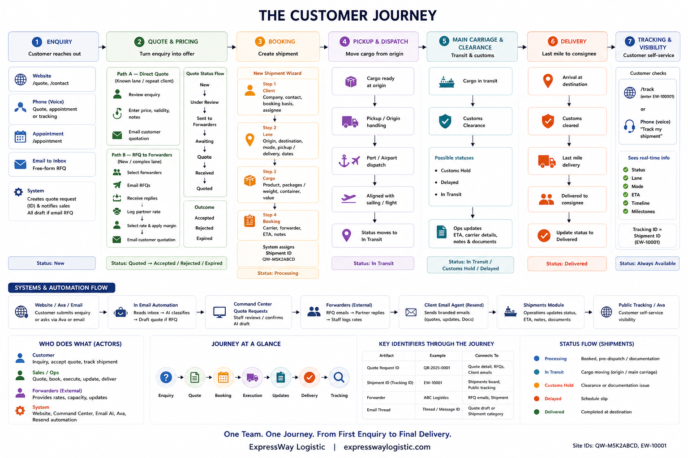
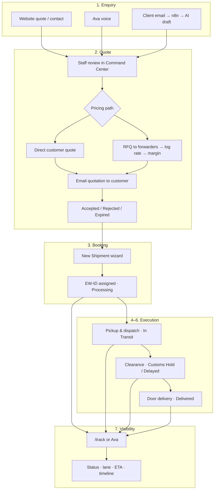

# ExpressWay Shipping — Full Journey

End-to-end flow from first enquiry through delivery and tracking.

**Actors:** Customer · Sales/Ops · Forwarder · System (website, Command Center, email automation, Ava)

**Site:** [expresswaylogistic.com](https://expresswaylogistic.com)  
**Command Center:** `/command-center`

 — [Site-accurate detail](./SHIPPING_JOURNEY_SITE_DETAIL.md)

---

## Journey map (high level)

```
Enquiry → Quote → Booking → Execution → Updates → Delivery → Tracking
   │         │        │          │          │          │          │
 Web/Ava   Pricing  Shipment   Pickup/    Customs/   Final     Public
 Email     & RFQ    created    dispatch   status     mile      /track
```

---

## Stage 1 — Enquiry

**Customer** shares what they want to ship.

| How they reach you | What they provide |
| --- | --- |
| Website `/quote` | Cargo, origin/destination, mode, contact |
| Website `/contact` | Short lead / basic details |
| `/appointment` | Books a consult slot |
| **Ava** (voice on site) | Quote, appointment, or tracking via conversation |
| **WhatsApp** (automated) | Quote, FAQs, appointment, tracking — number **in review with Meta** |
| **Email** to company inbox | Free-form RFQ in email |

**System:** Creates a **quote request** (reference ID) and notifies sales. On the email path, n8n reads the inbox → AI classifies the message → if it is an RFQ, a draft quote appears in Command Center for staff review.

**Outcome:** A quote record in **Quote Requests**, status starts at **New**.

---

## Stage 2 — Quote & pricing

**Sales/Ops** turns the enquiry into a priced offer.

### Path A — Direct quote (known lane / repeat customer)

```
Review quote → Enter amount, validity, notes → Email customer quotation
```

### Path B — Ask forwarders (new or complex lane)

```
Select active forwarders → Email RFQs to partners
    → Partner replies (email/phone)
    → Staff logs partner rate
    → Select rate, apply margin
    → Email customer quotation
```

**Quote statuses along the way:**

```
New → Under Review → [Sent to Forwarders → Awaiting → Quote Received] → Quoted
```

Customer receives the formal quote by email. Staff may later mark **Accepted**, **Rejected**, or **Expired**.

**Email AI path:** If the RFQ came from email, staff first **confirms** the AI draft (or chases missing info) before pricing — then follows Path A or Path B above.

---

## Stage 3 — Booking

**Customer confirms** the job (PO, payment, email OK, or verbal OK).

**Sales/Ops** creates the live shipment:

```
+ New Shipment (Command Center)
    Step 1 — Client: company, contact, booking basis, assignee
    Step 2 — Lane: origin, destination, mode, pickup/delivery, dates
    Step 3 — Cargo: product, packages/weight, container, value
    Step 4 — Booking: carrier, forwarder, ETA, notes
```

**System:** Assigns shipment ID **`EW-xxxxx`**, initial status **Processing**.

**Booking basis options:** PO received · Email confirmation · Payment received · Verbal OK

The shipment record holds client, lane, cargo, carrier, forwarder, dates, and internal notes — the operational source of truth for everything after the quote.

---

## Stage 4 — Pickup & dispatch

**Ops** moves cargo from origin toward the booked mode (ocean / air / road).

- Cargo ready date and pickup location drive scheduling
- Carrier name and carrier reference are recorded on the shipment
- Status moves from **Processing** toward **In Transit** when cargo is on the move

This is the handoff from “booked” to “in motion” — origin handling, port/airport dispatch, and alignment with the booked sailing or flight.

---

## Stage 5 — Main carriage & clearance

**Ops** tracks the shipment through transit and customs.

| Status | Meaning in the flow |
| --- | --- |
| **Processing** | Booked, pre-dispatch / documentation |
| **In Transit** | Cargo moving (origin leg or main carriage) |
| **Customs Hold** | Clearance or documentation issue |
| **Delayed** | Schedule slip |
| **Delivered** | Completed at destination |

Staff update status, ETA, carrier details, and internal notes in the **Shipment detail sheet**. Risk score reflects status (e.g. customs hold = higher risk on the ops dashboard).

**Parallel channel — inbound email:** Client or carrier emails about AWB, BL, ETA, or delays are classified as **shipment** in Email Intelligence so ops can see them alongside the board.

---

## Stage 6 — Delivery

**Ops** completes last mile after clearance.

- Destination delivery location is on the shipment record
- Status set to **Delivered** when the consignee receives cargo
- Internal notes capture delivery confirmation or exceptions

One team stays with the shipment from quote through the last mile — in the product that means the same Command Center thread from quote → shipment → delivered status.

---

## Stage 7 — Customer visibility (tracking)

**Customer** checks progress without logging in.

```
/track  →  enter EW-xxxxx  →  status, lane, mode, ETA, timeline
```

Same lookup is available via **Ava** (`track_shipment`). Ops can open public tracking from the shipment detail sheet to preview what the customer sees.

**Tracking ID = Shipment ID** (`EW-10001`, etc.)

---

## Who does what (actors)

```
┌─────────────┐     ┌─────────────┐     ┌─────────────┐
│  Customer   │     │ Sales/Ops   │     │ Forwarder   │
│  Enquiry    │────►│ Quote/Book  │────►│ RFQ reply   │
│  Accept     │     │ Execute     │     │ (external)  │
│  Track      │◄────│ Update      │     └─────────────┘
└─────────────┘     └──────┬──────┘
                           │
                    ┌──────▼──────┐
                    │   System    │
                    │ Web · CC ·  │
                    │ Email AI ·  │
                    │ Ava · Resend│
                    └─────────────┘
```

---

## End-to-end flow (diagram)



---

## Command Center modules in journey order

| Order | Module | Role in the flow |
| --- | --- | --- |
| 1 | **Quote Requests** | Enquiry → priced offer → accepted |
| 2 | **Forwarders** | Partner directory for RFQ path |
| 3 | **Email Intelligence** | Inbound RFQs and shipment-related mail |
| 4 | **Shipments** | Booking through delivery |
| 5 | **Calendar** | Appointments + shipment ETA windows |
| 6 | **Client Email Agent** | Branded outbound comms (alongside quote email) |
| 7 | **Overview / Analytics / AI** | Ops snapshot, volume, natural-language shipment queries |

---

## Customer-facing vs ops-facing

| Stage | Customer sees | Ops works in |
| --- | --- | --- |
| Enquiry | Quote form, Ava, email | Quotes, Email Intelligence |
| Quote | Quotation email | Quotes, Forwarders |
| Booking | Confirmation (email/PO) | Shipments (+ New Shipment) |
| In transit | `/track`, Ava | Shipments board, detail sheet |
| Delivery | Tracking shows Delivered | Shipments status update |

---

## IDs & links through the journey

| Artifact | Example | Connects to |
| --- | --- | --- |
| Quote request ID | From quote wizard / email AI | Quote detail, forwarder RFQs, client emails |
| Shipment ID | `EW-10001` | Shipments board, public tracking |
| Forwarder | Partner record | RFQ emails, optional link on shipment |
| Email thread | Ingested message | Quote draft or shipment category |

---

## Marketing process alignment

The public **Process** page (`/process`) describes the same five-step customer journey:

1. **Request a Quote** — Stage 1–2  
2. **Booking & Docs** — Stage 3  
3. **Pickup & Dispatch** — Stage 4  
4. **Clearance & Updates** — Stage 5  
5. **Door Delivery** — Stage 6  

Public tracking (`/track`) covers Stage 7.

---

## Related documentation

| Doc | Contents |
| --- | --- |
| [SHIPPING_JOURNEY_SITE_DETAIL.md](./SHIPPING_JOURNEY_SITE_DETAIL.md) | Site-accurate diagram (routes, IDs, APIs, CC modules) |
| [PRODUCT_OVERVIEW.md](./PRODUCT_OVERVIEW.md) | Full product & technical reference |
| [QUOTE_FLOW_DEMO_SCRIPT.md](./QUOTE_FLOW_DEMO_SCRIPT.md) | Click-by-click quote demo |
| [EMAIL_INTELLIGENCE.md](./EMAIL_INTELLIGENCE.md) | Email ingest & classification |
| [API.md](./API.md) | REST endpoint reference |

---

*ExpressWay Logistic — PAN India Freight Forwarding & Global Logistics*
