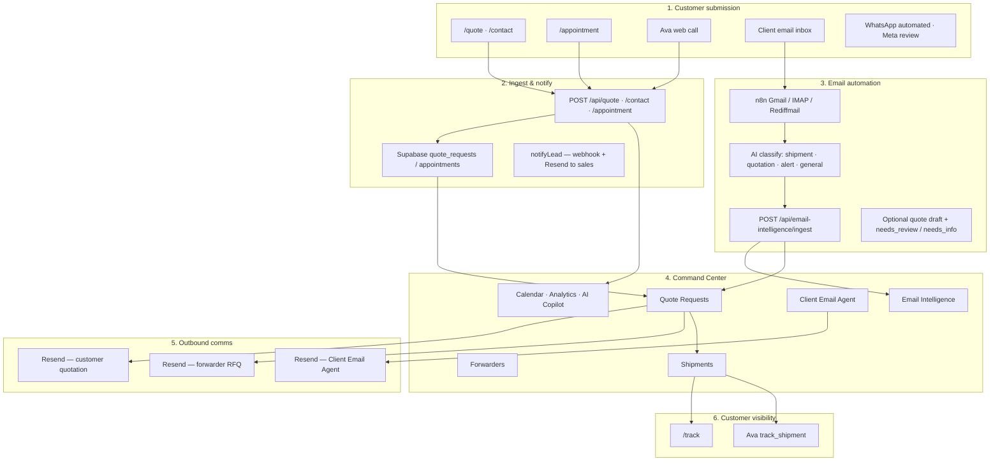
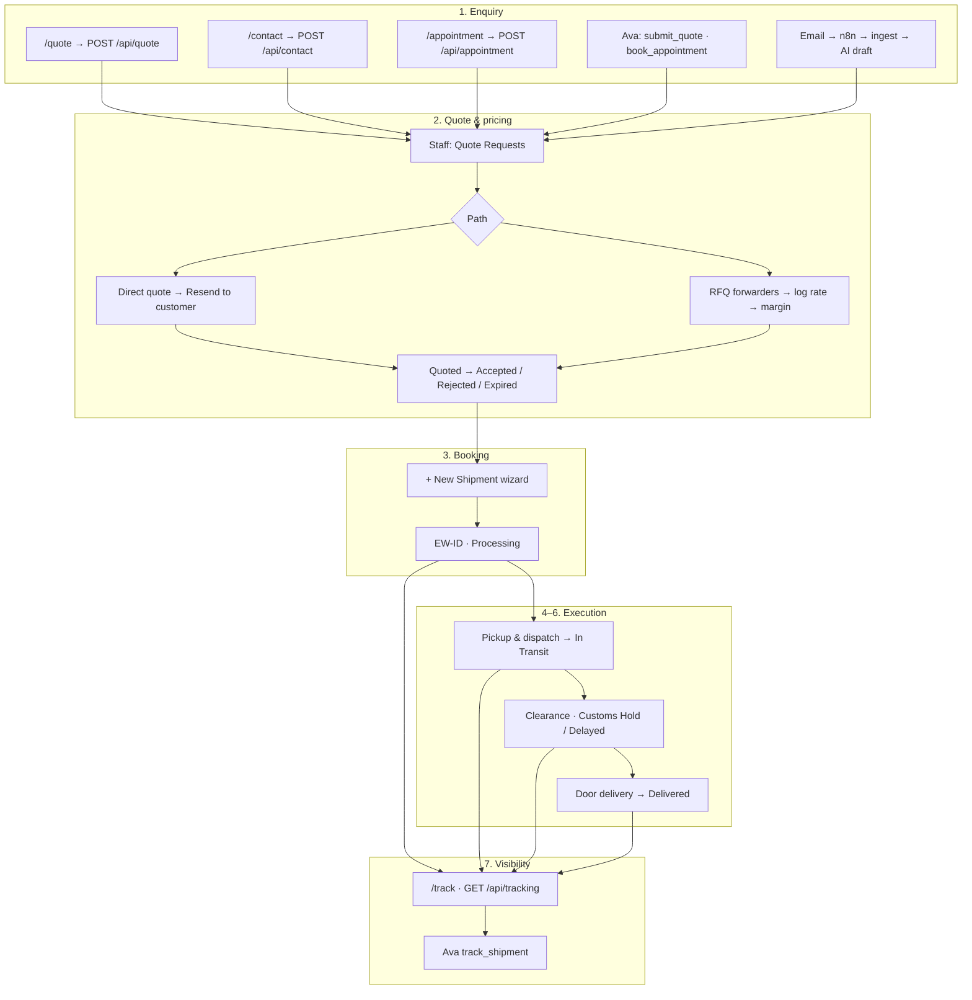

# ExpressWay Logistic — End-to-End Journey (Site-Accurate)

**Site:** [expresswaylogistic.com](https://expresswaylogistic.com)  
**Company:** Expressway Logistic Private Limited  
**Tagline:** PAN India Freight Forwarding & Global Logistics  
**Ops workspace:** `/command-center` (staff login at `/login`)


Regenerate the poster (automation-first layout, site logo): `python3 scripts/generate-journey-poster.py`

This document validates the journey diagram against the live product and replaces generic labels with real routes, IDs, APIs, and Command Center modules.

---

## Is the diagram correct?

**Mostly yes.** The seven-stage flow (Enquiry → Quote → Booking → Pickup → Clearance → Delivery → Tracking) and the systems bar (Website/Ava/Email → n8n → Command Center → Forwarders → Resend → Shipments → `/track`) match the product.

**Corrections to apply:**

| Item in diagram | Actual on site |
| --- | --- |
| Brand name **ExpressWay Shipping** | **ExpressWay Logistic** (`siteConfig.name`) |
| Quote ID **`QR-2025-0001`** | **`QW-{base36 timestamp}`** (e.g. `QW-M5K2ABCD`) via `createQuoteReferenceId()` |
| Appointment ID (not shown) | **`AP-{base36 timestamp}`** via `createAppointmentReferenceId()` |
| Shipment ID **`EW-10001`** | Correct format **`EW-xxxxx`** (auto-increment from latest row) |
| Email path only | Also **`/contact`** (short lead) and **WhatsApp** (automated AI agent — phone number **in review with Meta**; `wa.me` until API live) |
| Ava “voice on site” | **Web call only** — Retell SDK when configured, else on-site speech + TTS; **no phone number** |
| Quote auto-send implied | **Staff must click “Email customer quote”** — AI never auto-emails customer or forwarders |
| Quote statuses | Also **`Quote Ready` / `Email Failed`** when Resend fails (retry from UI) |
| Email AI | Review states: **`needs_review` · `needs_info` · `confirmed` · `dismissed`** |
| Systems bar | Add **Email Intelligence** board, **Calendar**, **Analytics**, **AI Copilot** as CC modules |
| Customer marketing journey | Public **`/process`** shows **5 steps**; ops journey is **7 stages** (tracking is stage 7) |

---

## Two surfaces, one journey

```mermaid
flowchart LR
  subgraph public [Public site — expresswaylogistic.com]
    M[Marketing pages]
    Q[/quote · /contact]
    A[/appointment]
    T[/track]
    V[Ava voice widget]
    W[WhatsApp link]
  end

  subgraph ops [Command Center — /command-center]
    CC1[Quote Requests]
    CC2[Forwarders]
    CC3[Email Intelligence]
    CC4[Client Email Agent]
    CC5[Shipments]
    CC6[Calendar]
    CC7[Analytics · AI Copilot]
  end

  subgraph auto [Automation]
    N8N[n8n inbox trigger]
    AI[AI classify + draft]
    RS[Resend outbound]
  end

  Q --> CC1
  A --> CC6
  V --> CC1
  W --> CC1
  N8N --> AI --> CC3
  AI --> CC1
  CC1 --> RS
  CC4 --> RS
  CC1 --> CC5
  CC5 --> T
  V --> T
```

---

## Stage 1 — Enquiry

**Customer actions**

| Channel | Route / entry | API | Rate limit |
| --- | --- | --- | --- |
| Quote wizard | `/quote` | `POST /api/quote` | 6 req / IP / min |
| Contact / short lead | `/contact` | `POST /api/contact` | 8 / IP / min |
| Appointment | `/appointment` | `POST /api/appointment` | 8 / IP / min |
| Ava voice | Help / voice widget | `POST /api/voice-agent/retell/tools` | — |
| Email RFQ | Company inbox | n8n → `POST /api/email-intelligence/ingest` | Bearer secret |
| WhatsApp | Meta Cloud API (number in Meta review) | Automated AI (planned) | `/api/whatsapp/webhook` |

**Ava tools (Retell or on-site fallback)**

| Tool | Action |
| --- | --- |
| `get_site_info` | Company, services, contact facts |
| `submit_quote` | Creates quote → same store as `/quote` |
| `book_appointment` | Creates appointment → Calendar |
| `track_shipment` | Same lookup as `/track` |

**System outcome**

- Quote/contact/voice → **`quote_requests`** row, status **`New`**, ID **`QW-…`**
- Appointment → lead + **`AP-…`**, visible on **Calendar**
- Email RFQ → **Email Intelligence** row + optional linked quote with AI draft

**Ops workspace:** Quote Requests · Email Intelligence · Calendar · Overview

---

## Stage 2 — Quote & pricing

**Path A — Direct quote** (known lane / repeat customer)

```
/command-center/quotes → open detail sheet
  → Quote the customer → amount, validity, notes
  → Save (draft) OR Email customer quote
  → POST /api/quotes/:id/send (Resend)
       ├─ success → Quoted (UI: Emailed)
       └─ failure → Quote Ready / Email Failed (UI: Failed → Retry)
```

**Path B — Ask forwarders** (new / complex lane)

```
Select Active forwarders (/command-center/forwarders)
  → POST /api/quotes/:id/forwarders (RFQ emails via Resend)
  → Partner replies outside app (email/phone)
  → POST /api/quotes/:id/forwarder-quotes (log rate)
  → POST /api/quotes/:id/select-forwarder (margin → customer amount)
  → Email customer quote (same as Path A)
```

**Email AI path** (RFQ arrived by email)

```
n8n classify → ingest API
  ├─ complete RFQ → quote + ai_review_status: needs_review (AI draft)
  └─ incomplete   → needs_info (+ sales alert)
Staff: Confirm and take over → Under Review
  OR dismiss → then Path A or B
```

**Quote status pipeline**

```
New
 → Under Review
 → Sent to Forwarders
 → Awaiting Forwarder Quotes
 → Quote Received
 → Quoted (or Quote Ready / Email Failed)
 → Accepted | Rejected | Expired
```

**Terminal outcomes:** Accepted · Rejected · Expired

**Ops workspace:** Quote Requests · Forwarders · Email Intelligence · Client Email Agent (optional branded follow-up)

---

## Stage 3 — Booking

**Trigger:** Customer confirms (PO, payment, email OK, or verbal OK).

**Ops:** **+ New Shipment** wizard at `/command-center/shipments`

| Step | Fields |
| --- | --- |
| 1 — Client | Company, contact, booking basis, assignee |
| 2 — Lane | Origin, destination, mode, pickup/delivery, dates |
| 3 — Cargo | Product, packages/weight, container, value (INR) |
| 4 — Booking | Carrier, forwarder, ETA, internal notes |

**Booking basis enum:** `po_received` · `email_ok` · `payment_received` · `verbal_ok`

**System:** Assigns **`EW-xxxxx`**, status **`Processing`**, optional link to **`quote_request_id`**

**API:** `POST /api/shipments` (staff session)

---

## Stages 4–6 — Execution (Pickup → Clearance → Delivery)

**Ops updates** on shipment detail sheet (`PATCH /api/shipments/:id`):

| Status | Meaning |
| --- | --- |
| **Processing** | Booked, pre-dispatch / documentation |
| **In Transit** | Cargo moving (origin or main carriage) |
| **Customs Hold** | Clearance or documentation issue |
| **Delayed** | Schedule slip |
| **Delivered** | Consignee received cargo |

**Milestones (ops, not separate statuses):**

1. **Pickup & dispatch** — cargo ready, carrier ref, origin handling, port/airport
2. **Main carriage & clearance** — ETA updates, customs, risk score on dashboard
3. **Delivery** — last mile to `delivery_location`, status → **Delivered**

**Parallel channel:** Inbound client/carrier email (AWB, BL, ETA, delays) → n8n → category **`shipment`** → Email Intelligence (alongside board)

**Ops workspace:** Shipments board · Email Intelligence · Calendar (ETA windows)

---

## Stage 7 — Customer visibility (tracking)

**Public:** `/track` → enter **`EW-xxxxx`** → `GET /api/tracking?id=`

**Shows:** Status · lane · mode · ETA · milestone timeline

**Also via Ava:** `track_shipment` tool (same backend)

**Ops preview:** “Open public tracking” link on shipment detail sheet

**Note:** Tracking uses the logistics-data adapter today (demo-capable); swap `src/services/logistics-data.ts` for live TMS without changing the UI contract.

---

## Systems & automation (behind the scenes)



---

## Public marketing site (acquisition layer)

These pages drive SEO and enquiries; they feed the same quote/appointment/tracking flows above.

| Nav label | Route | Role in journey |
| --- | --- | --- |
| Services | `/services`, `/services/[slug]` | 15 service detail pages |
| Industries | `/industries`, `/industries/[slug]` | 12 cargo verticals |
| PAN India | `/pan-india-logistics`, `…/[slug]` | Origin coverage SEO |
| Routes | `/shipping-routes`, `…/[slug]` | Trade-lane SEO |
| About | `/about` | Company story |
| Track | `/track` | Stage 7 |
| **Get a Quote** (CTA) | `/quote` | Stage 1–2 |
| Process | `/process` | Customer-facing 5-step journey |
| Locations | `/locations`, `…/[slug]` | Office / port pages |
| Resources | `/resources`, guides, FAQ, glossary | SEO / AEO content |
| Ops Login | `/command-center` | Staff entry |

**Customer `/process` steps (marketing copy):**

1. Request a Quote → Stages 1–2  
2. Booking & Docs → Stage 3  
3. Pickup & Dispatch → Stage 4  
4. Clearance & Updates → Stage 5  
5. Door Delivery → Stage 6  

Public **`/track`** = Stage 7.

---

## Command Center modules (journey order)

| # | Module | Route | Journey role |
| --- | --- | --- | --- |
| 1 | Overview | `/command-center` | Ops snapshot, KPIs |
| 2 | Quote Requests | `/command-center/quotes` | Enquiry → priced offer |
| 3 | Forwarders | `/command-center/forwarders` | RFQ partner directory |
| 4 | Email Intelligence | `/command-center/emails` | Inbound RFQ + shipment mail |
| 5 | Client Email Agent | `/command-center/client-email` | Branded outbound AI email |
| 6 | Shipments | `/command-center/shipments` | Booking → delivery |
| 7 | Calendar | `/command-center/calendar` | Appointments + ETA |
| 8 | Analytics | `/command-center/analytics` | Volume / ops charts |
| 9 | AI Copilot | `/command-center/ai` | NL ops queries |

---

## Key identifiers

| Artifact | Format | Example | Links to |
| --- | --- | --- | --- |
| Quote request ID | `QW-{base36}` | `QW-M5K2ABCD` | Quote detail, RFQs, client emails |
| Appointment ID | `AP-{base36}` | `AP-M5K2WXYZ` | Calendar, lead notify |
| Shipment / tracking ID | `EW-{number}` | `EW-10001` | Shipments board, `/track` |
| Forwarder | UUID + name | ABC Logistics | RFQ emails, shipment.forwarder_id |
| Email thread | ingest message id | — | Quote draft or shipment category |

---

## Actors

| Actor | Does |
| --- | --- |
| **Customer** | Enquires via site/Ava/email/WhatsApp · accepts quote · tracks at `/track` |
| **Sales / Ops** | Reviews quotes · prices · emails customer & forwarders · books shipment · updates status |
| **Forwarder** | Receives RFQ email · replies with rate (logged by staff) |
| **System** | Website · Command Center · n8n · Email AI · Ava · Resend · Supabase |

---

## Full journey (single diagram)



---

## Related docs

| Doc | Contents |
| --- | --- |
| [SHIPPING_JOURNEY.md](./SHIPPING_JOURNEY.md) | Ops-focused journey (concise) |
| [PRODUCT_OVERVIEW.md](./PRODUCT_OVERVIEW.md) | Full product & API reference |
| [QUOTE_FLOW_DEMO_SCRIPT.md](./QUOTE_FLOW_DEMO_SCRIPT.md) | Click-by-click quote demo |
| [EMAIL_INTELLIGENCE.md](./EMAIL_INTELLIGENCE.md) | n8n + ingest setup |

---

*ExpressWay Logistic — One team. One journey. From first enquiry to final delivery.*
